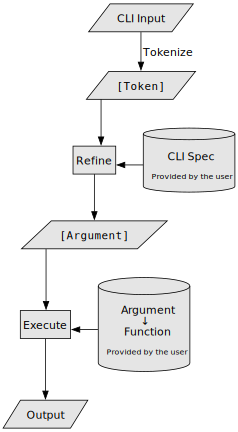

# Oclis

CLI (Command Line Interface) app builder
based on a simple, obvious specification file.

## Motivation

Building a CLI application is a repetitive task.
The same code is written over and over again.
But fear not, Oclis is here to help you out!

## Usage

1. Install Oclis with
   `cargo install --git https://github.com/Airsequel/Oclis`
1. Create a `oclis.ncl` specifcation file in the root of your project. \
   (Check out the [examples](./examples) directory for inspiration.)
1. Run `oclis build` to generate the CLI parsing code \
   (Automatically detects main repo language,
   but only supports PureScript at the moment.)
1. Define the handler functions for your commands. \
   (Check out the [main function of Transity][tr-main] for an example.)
1. Build and use your project as usual 🎉

[tr-main]: https://github.com/feramhq/Transity/blob/master/src/Main.purs#L332

> [!NOTE]
> The generated code must be committed to the repository.

## How It Works

### Processing Pipeline of the Generated CLI App

## Related

### Other CLI Builders

- [CLI Definition Language] - DSL for defining command line interfaces
    of C++ programs.
- [Decli] - Declarative CLI tool builder.
- [docopt] - Command-line interface description language.
- [make-cli] - Declarative CLI framework for Node.js.

[CLI Definition Language]: https://www.codesynthesis.com/projects/cli/
[Decli]: https://github.com/woile/decli
[docopt]: http://docopt.org/
[make-cli]: https://github.com/dword-design/make-cli

### Manual CLI Frameworks

Check out the repo
[awesome-cli-frameworks](https://github.com/shadawck/awesome-cli-frameworks)
for a full overview.

### Specifications

- [clig.dev] - Command Line Interface Guidelines.
- [GNU Table of Long Options][gtolo]
- [Heroku CLI Style Guide][hcsg]
- [OpenAutoComplete] - CLI autocomplete specification.
- [POSIX Utility Conventions][puc]

[clig.dev]: https://clig.dev
[gtolo]:
  https://www.gnu.org/prep/standards/html_node/Option-Table.html#Option-Table
[hcsg]: https://devcenter.heroku.com/articles/cli-style-guide
[OpenAutoComplete]: https://github.com/openautocomplete/openautocomplete
[puc]: https://pubs.opengroup.org/onlinepubs/9699919799/basedefs/V1_chap12.html

### Generate GUIs From CLI

- [Claui] - A GUI generator for [clap] using [egui].
- [Gooey] - Turn CLI programs into a full GUI application.
- [Klask] - Automatically create GUI applications from [clap] apps.

[clap]: https://github.com/clap-rs/clap
[Claui]: https://github.com/grantshandy/claui
[egui]: https://github.com/emilk/egui
[Gooey]: https://github.com/chriskiehl/Gooey
[Klask]: https://github.com/MichalGniadek/klask

### Generate GUIs From Simple Code

- [Sparkle] - Infer user interfaces from type signatures.
- [Streamlit] - Turns data scripts into shareable web apps.

[Sparkle]: https://github.com/sharkdp/purescript-sparkle
[Streamlit]: https://github.com/streamlit/streamlit
